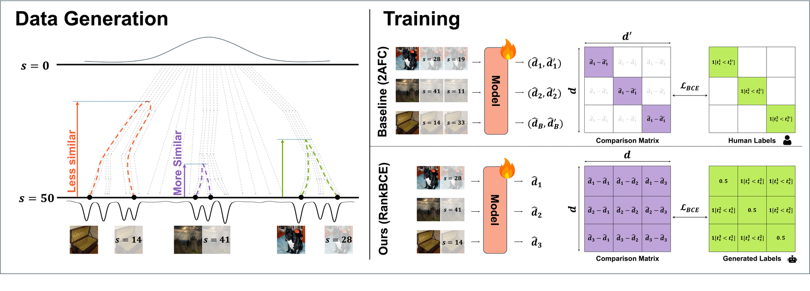
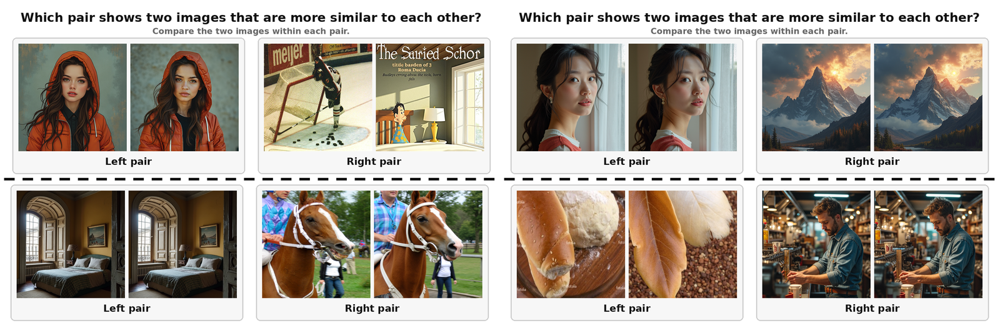

# FoMo: Forking Moment in Generative Trajectory as a Perceptual Distance

<p align="center">
  
</p>
<p align="center">
  
</p>

FoMo trains reference-based perceptual distance metrics **without human labels**. Running a diffusion model (FLUX.1-dev) in img2img mode from a base image, re-entering the trajectory `s` denoising steps before the end, produces a variant whose perceptual deviation from the base grows monotonically with `s` — the *forking moment* of the generative trajectory. The timestep is therefore a free, dense supervision signal: we generate 480k such image sets and train distance models with a pairwise ranking objective on it.

Seven models are released, all trained on the same 480k FoMo dataset with the same ranked-BCE objective; only the frozen backbone / trainable part differs:

| Name | Architecture | Trained part |
|---|---|---|
| `lpips_alex` | LPIPS, AlexNet features | linear calibration weights |
| `lpips_vgg`  | LPIPS, VGG-16 features  | linear calibration weights |
| `dists`      | DISTS, VGG-16 features  | α / β mixing weights |
| `dinov3`     | frozen DINOv3 ViT-S/16+ + prediction head | 3-layer 2D-RoPE transformer head |
| `clip`       | frozen CLIP ViT-B/32 + prediction head    | 3-layer 2D-RoPE transformer head |
| `mae`        | frozen MAE ViT-B/16 + prediction head     | 3-layer 2D-RoPE transformer head |
| `dreamsim`   | DreamSim ensemble (DINO + CLIP + OpenCLIP ViT-B/16) | LoRA adapters (r=16) |

## Using the pretrained models

```bash
pip install fomo-iqa          # or, from this repository:  pip install -e .
```

(The distribution is `fomo-iqa` because `fomo` is taken on PyPI; the import name is `fomo`.)

```python
import fomo

# A model is defined by its backbone alone. How the score is presented —
# `symmetric` and `output` — is chosen per call.

# --- a CNN model --------------------------------------------------------------
lpips_alex = fomo.FoMo('lpips_alex')
d = lpips_alex(img_ref, img_test)                     # [B]; lower = more similar
                                                      # symmetric by construction, so
                                                      # `symmetric` changes nothing here

# --- a prediction-head model --------------------------------------------------
dinov3 = fomo.FoMo('dinov3')
d      = dinov3(img_ref, img_test, symmetric=True)    # 'raw' (default): what evaluation
                                                      # uses. May be negative;
                                                      # lower = more similar
d_asym = dinov3(img_ref, img_test, symmetric=False)   # single order s(x, y)

# `symmetric=True` is the default and only affects dinov3 / clip / mae, where the
# head reads the two images as one sequence: it averages both argument orders
# from a single backbone pass.

# --- as a perceptual loss ------------------------------------------------------
# differentiable w.r.t. the inputs. output='loss' is hinged at the identity
# level, so optimization settles once the images are as close as identical
# instead of continuing past that point.
loss = dinov3(prediction, target, output='loss').mean()
loss.backward()
```

`fomo.load(name)` returns the underlying `DistanceModel` (method `eval_distance`), and `checkpoint='path/to/file.pth'` loads a local file — including a `ckpt_latest.pt` produced by `train.py` (its EMA weights are used). `python example_usage.py --model dinov3 --mode metric|loss` is a runnable demo.

**Inputs.** Float tensors `[B, 3, H, W]` in `[0, 1]`. Do **not** normalize — each model applies its own preprocessing (ImageNet statistics for DINOv3 / MAE, CLIP statistics for CLIP, `[-1, 1]` for LPIPS, raw for DISTS, bicubic resize to 224 for DreamSim). Both images of a pair must share a spatial size; any size works (the ViT models zero-pad to their patch grid). Benchmarks are scored at native resolution.

**Distance options.**

- `lpips_alex`, `lpips_vgg`, `dists` and `dreamsim` compute a symmetric distance directly (DreamSim as the cosine distance of its embeddings). `dinov3`, `clip` and `mae` read the two images as one concatenated token sequence and output a scalar for that ordered pair.
- `symmetric` (default `True`): for `dinov3` / `clip` / `mae` the output `s(x, y)` need not equal `s(y, x)`, so the score is `½ [s(x, y) + s(y, x)]`, both orders from a single backbone pass. `symmetric=False` returns the single order `s(x, y)`.
- `output` (default `'raw'`): `'raw'` returns the model output — what evaluation uses, and what every published number is computed from. `'loss'` returns `relu( d(x, y) − max(d(x, x), d(y, y)) )`, hinged at the identity pair, for use as a perceptual loss; the anchor is detached so that optimizing one image cannot lower the loss by changing its own self-score.

  | `output` | returns | use it for |
  |---|---|---|
  | `'raw'` (default) | the model output, unchanged | evaluation, and every published number |
  | `'loss'` | `relu( d(x, y) − max(d(x, x), d(y, y)) )` | a perceptual loss / image optimization |

  **Evaluate on `'raw'`; lower means more similar.** `dinov3`, `clip` and `mae` return negative values. If you would rather report a non-negative figure, apply a monotone non-negative function such as `softplus` — averaging the raw scores first and transforming that average:

  ```python
  scores   = torch.cat([metric(ref, out) for ref, out in loader])   # output='raw'
  reported = torch.nn.functional.softplus(scores.mean())
  ```

  Being monotone, it preserves the ordering of whatever you are comparing.

**Backbone downloads.** The frozen backbones are fetched from their public sources on first use (torchvision for AlexNet / VGG, HuggingFace for CLIP / MAE / DINOv3, the DreamSim release for its three ViTs, ~1.5 GB into `~/.cache/fomo/dreamsim`, override with `FOMO_DREAMSIM_CACHE`). **DINOv3 is gated:** accept the license of `facebook/dinov3-vits16plus-pretrain-lvd1689m` on HuggingFace and run `huggingface-cli login` before using `dinov3`.

## Repository layout

```
fomo/                        pip package (metric / loss usage)
├── model.py                 DistanceModel — the seven models
├── dinov3.py                prediction head (2D-RoPE attention, SwiGLU, registers)
└── hub.py                   fomo.load() / fomo.FoMo, checkpoint download
generate_fomo_dataset.py     FLUX img2img data generation
dataset.py                   FoMoDataset + paired augmentation, benchmark loaders
train.py                     ranked-BCE training
evaluation.py / evaluate.py  PIPAL / TID2013 / CSIQ / LIVE metrics, CLI
example_usage.py             metric + loss demo
checkpoints/                 model card for the Hub repo (the .pth files live on the Hub)
scripts/
├── download_fomo_480k.sh    fetch the released 480k training set
├── generate_fomo_480k.sh    …or regenerate it with FLUX
├── setup_benchmarks.sh      fetch the four evaluation benchmarks
└── train.sh                 train one model with the paper's configuration
```

## Environment

```bash
conda env create -f environment.yml     # env "fomo": torch 2.9.1, transformers 4.57.3, diffusers 0.37.1
conda activate fomo
```

Training assumes a bf16-capable GPU; evaluation runs on one GPU.

## Data

**Download the released dataset** (recommended) — 480,000 samples at 512×512, hosted as 240 tar shards (~550 GB) at [JHLew/fomo_480k](https://huggingface.co/datasets/JHLew/fomo_480k):

```bash
bash scripts/download_fomo_480k.sh      # → ./data/fomo/{train/…, index.json}
```

Each sample is a base image plus two img2img variants at random timesteps `s ∈ [1, 50]` (FLUX.1-dev, 50 steps, guidance 3.5; the variant files are named by `s`). The `s` used in this repository and in the dataset corresponds to `S − s` in the paper, with `S = 50`. Half of the bases are generated from a blank canvas (`FLUX_*`), half are ImageNet-1k crops (`IN1K_*`). `index.json` lists `{"base": …, "variants": […]}` with paths relative to the dataset root.

**Or regenerate it** — this is the data-generation pipeline, the core of the method:

```bash
huggingface-cli login                    # FLUX.1-dev is gated
bash scripts/generate_fomo_480k.sh       # STAGE=scratch|in1k|both, shard with IDX_FROM / IDX_TO
```

`generate_fomo_dataset.py` writes `<out>/train/<TAG>_<idx>/{base.png, <t1>.png, <t2>.png}` and appends to `index.json`. The IN1K stage needs ImageNet-1k at `./imagenet-1k/train/<class>/*.JPEG`. Generation is expensive (2–3 FLUX calls per sample); shard the index range across GPUs.

**Benchmarks:**

```bash
bash scripts/setup_benchmarks.sh         # PIPAL, TID2013, CSIQ, LIVE → ./benchmarks/
```

## Training

One command trains a model with the paper's configuration and evaluates it on the four benchmarks after every epoch:

```bash
bash scripts/train.sh dino            # lpips_alex | lpips_vgg | dists | dino | clip | mae | dreamsim
```

which runs

```bash
python train.py --exp_name dino --backbone dino \
    --dataroot ./data/fomo --train_index_file ./data/fomo/index.json \
    --epochs 3 --batch_size 64 --lr 1e-4 --min_crop_size 64 --max_crop_size 256
```

Each sample yields one training pair: two of its three images in random order (or, with probability 1/51, an image paired with itself), labelled with the FLUX-space value of the larger timestep `s` of the two, recomputed for the sampled resolution. The ranked-BCE loss scores every ordered pair of samples in the batch against this label ordering. Settings:

- `lpips_alex` / `lpips_vgg` / `dists`: `--lr 2e-4`, fixed crops `--min_crop_size 256 --max_crop_size 256`.
- `dino` / `clip` / `mae`: `--lr 1e-4`, random 64–256 crops batched by zero-padding + attention masking.
- `dreamsim`: `--lr 1e-4`, fixed `--min_crop_size 224 --max_crop_size 224` (fixed-resolution ensemble).
- Benchmarks are evaluated after every epoch with the **EMA weights at native resolution**; the final epoch is what is reported. Outputs go to `experiments/<exp_name>/` (`ckpt_latest.pt`, `metrics.json`, `train.log`, TensorBoard); rerunning the same command resumes.

The final-epoch numbers of such a run land close to the table below. Any checkpoint can be re-scored on its own:

```bash
python evaluate.py --model dinov3                                                  # released weights
python evaluate.py --model dinov3 --checkpoint experiments/dino/ckpt_latest.pt      # your run
```

### Results

SROCC / KROCC / PLCC of the released checkpoints (native resolution; PLCC after a 5-parameter logistic fit). `python evaluate.py --model <name>` reproduces every cell:

| Model | PIPAL | TID2013 | CSIQ | LIVE |
|---|---|---|---|---|
| LPIPS-Alex| 0.739 / 0.541 / 0.773 | 0.782 / 0.583 / 0.813 | 0.940 / 0.784 / 0.946 | 0.949 / 0.794 / 0.943 |
| LPIPS-VGG | 0.691 / 0.503 / 0.739 | 0.659 / 0.486 / 0.746 | 0.852 / 0.665 / 0.880 | 0.918 / 0.740 / 0.918 |
| DISTS     | 0.616 / 0.437 / 0.657 | 0.692 / 0.513 / 0.771 | 0.919 / 0.750 / 0.931 | 0.954 / 0.804 / 0.949 |
| DINOv3    | 0.705 / 0.504 / 0.709 | 0.711 / 0.524 / 0.769 | 0.810 / 0.626 / 0.874 | 0.897 / 0.721 / 0.913 |
| CLIP      | 0.668 / 0.479 / 0.679 | 0.744 / 0.556 / 0.800 | 0.911 / 0.735 / 0.928 | 0.935 / 0.770 / 0.936 |
| MAE       | 0.644 / 0.453 / 0.634 | 0.674 / 0.495 / 0.681 | 0.817 / 0.625 / 0.830 | 0.919 / 0.752 / 0.926 |
| DreamSim  | 0.790 / 0.585 / 0.779 | 0.806 / 0.610 / 0.836 | 0.894 / 0.710 / 0.905 | 0.933 / 0.773 / 0.936 |

## Citation

The paper is under review; citation information will be added here.

## License

Apache 2.0 — see [LICENSE](LICENSE). The backbones (DINOv3, CLIP, MAE, DreamSim's ViTs) and the `lpips` / `DISTS-pytorch` / `dreamsim` packages keep their own upstream licenses.
